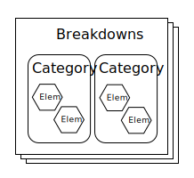
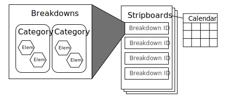

# Universal Schedule Standard Documentation

## Table of Contents
- [Data Overview](#data-overview)
- [Structure and Format](#structure-and-format)
    - [ID Values](#id-values)
    - [Date Format](#date-format)
    - [Include All Keys](#include-all-keys)
    - [Maintaining Data Types](#maintaining-data-types)
- [Header Information](#header-information)
- [Breakdowns](#breakdowns)
    - [Breakdown Objects](#breakdown-objects)
    - [Category Objects](#category-objects)
    - [Element Objects](#element-objects)
- [Schedules](#schedules)
    - [Stripboard Objects](#stripboard-objects)
    - [Calendar Objects](#calendar-objects)
- [Extending the Standard](#extending-the-standard)

# Data Overview

The central purpose of this standard is to allow for the storage and transport of script breakdown information and schedules between individuals and platforms. In order to do this, it is first necessary to understand the types of data we'll be dealing with and how those different types relate to each other. 

Also, it is important to differentiate this format from a backup of any particular software system. This standard does not attempt to back up user settings, preferences, state or any other data outside of the breakdown and schedule. Nor does this standard attempt to backup the contents of the script, except for the data that is directly used in a breakdown. 

Breakdown documents are created for every scene (or scenes) and each breakdown contains elements, which are categorized. For example, if an umbrella appears in the scene it will be added to a breakdown for that scene. When that element is first created it is assigned to a category so that all similar elements may be found more easily.



Each breakdown object in this scenario just has a data type of 'scene'.

When creating a schedule out of these breakdowns, all of the breakdown IDs are added to a stripboard, as an ordered list. Additional breakdown types are created to represent banners and day breaks and added to the stripboard. A calendar is applied to each stripboard so that the day breaks can properly reflect shoot dates and days off.



In a schedule breakdown objects are one of three types: 'scene', 'day' or 'banner'.

# Structure and Format

The Entertainment Industry Breakdown Format (EIBF) standard conforms to the [JSON](https://www.json.org/json-en.html) standard and is essentially a structured JSON store of relational data. 

The complete EIBF object is constructed as:

```
{
  "entertainmentIndustryBreakdownFormat": {
    "id": string | ID value,
    "author": string | name of individual creator,
    "created": string | ISO Date,
    "description": string | description of file,
    "name": string | name of the schedule,
    "project": string | name of the project,
    "schedColor": string | name of the schedule color,
    "schedDate": string | ISO Date,
    "scriptColor": string | name of the script color,
    "scriptDate": string | ISO Date,
    "source": string | name of originating site,
    "version": string | EIBF version number,

    "breakdowns": array of breakdown objects,
    "calendars": array of calendar objects | required only for schedules,
    "categories": array of category objects,
    "elements": array of element objects,
    "stripboards": array of stripboard objects | required only for schedules
    }
  }
}
```

## **ID Values**
Throughout the EIBF object, each sub-object contains its own unique ID value. Unique values help in the identification of any data that may already exist in a system. For example, when importing a breakdown into software, an importer can check to see if individual breakdowns or elements have been previously imported, thus potentially reducing the amount of duplicated data. 

It is considered best practice to use a 12 byte [BSON ObjectID](https://docs.mongodb.com/manual/reference/method/ObjectId/) but any UUID will suffice. An example ID would look like `"5d9fc8cfc0efae0017a3201a"`.

## **Date Format**
 Dates should all be [ISO Date Format](https://www.iso.org/iso-8601-date-and-time-format.html) and should follow the format `"2020-06-24T08:00:00.000Z"`

## **Include All Keys**
It is considered best practice to include all keys in the object, even if unused. Skipping the inclusion of keys could throw errors in third party parsers. 

## **Maintaining Data Types**
Please maintain the correct data type for each key. The use of incorrect data types (ie using a string where an array is expected) will likely throw an error during parsing. 

If you are not using a particular key, you may give it a value of either it's empty data type (ie "" for strings, [] for arrays, etc) or `null`.

# Header Information

The header keys describe the overall EIBF object's contents. Please see the [/samples](https://github.com/thinkcrew/entertainmentIndustryScheduleFormat/tree/master/samples) folder for example values.

The header keys are `id`, `author`, `created`, `description`, `name`, `project`, `schedColor`, `schedDate`, `scriptColor`, `scriptDate`, `source`, and `version`. All keys are required and their value may be `null` if no information is available.

The `version` refers to the EIBF version, not the version of the schedule. This is used to differentiate different versions of the standard over time.

# Breakdowns

All EIBF objects must contain arrays of `breakdowns`, `categories` and `elements` objects. These three types of object arrays will make up the breakdown information.

## **Breakdown Objects**

The breakdown objects contain information about a scene (or scenes) in a script. 

```
{
  "id": string | ID value,
  "comments": string,
  "created": string | ISO Date,
  "description": string | description of scene,
  "elements": array of ID string values,
  "pages": number | decimal value of page eighths,
  "scene": string | scene number,
  "scriptPage": string | page number scene starts on,
  "time": number | millisecond duration to shoot scene,
  "type": string | one of 'scene|day|banner'
}
```

Some scheduling software includes [scene categories](#scene-categories) as part of the breakdown itself. Examples of these keys are `Unit`, `Location` and `Script Day`. These are not included as keys in the object directly, but can be inferred by the inclusion of elements that are in those categories. For instance, the inclusion of an element with the `name`: 'D12', which is in the `Script Day` category, will mean that this breakdown is for a scene that takes place on D12 in the script.

The `elements` array contains element IDs that represent all of the elements in the breakdown. 

The `time` key refers to the estimated time it will take to shoot the scene. This is measured in milliseconds in order to easily conform to common coding practices. An example value would be '5700000' if the scene were estimated to take 1h 35m to shoot. (95m * 12 * 1000)

The `type` key has one of three values: 'scene', 'day' or 'banner'. 'Day' types only need to include an `id` and `created` and `type` keys, the remaining keys can be `null`. 'Banner' types should store their text in the `description` value. 

Note that all `type`s can store values as needed, depending on your preference. If you'd like to have 'day' types store the total pages for that day in the `pages` value, feel free. Likewise, 'banner's can store as much information as a 'scene' type. 

## **Category Objects**

A category represents a group of similar elements. 'Cast Members', 'Props' and 'Wardrobe' are all different categories. All elements must be listed in exactly one category.

```
{
  "id": string | ID value,
  "catId": number | integer ID of corresponding category,
  "created": string | ISO Date,
  "elements": array of ID string values,
  "name": string | name of this category
}
```

The `catId` refers to the category ID number listed in the [Category Types Standard](#category-types-standard). All categories must conform to this standard by either using one of the existing category ID numbers or by using a custom number that is outside of the protected ranges, as described in that section.

The `elements` array is made up of element IDs and represent all of the elements that are in that category. 

Categories may be `name`d anything, but should follow the original intent of the category, as described in the [Category Types Standard](#category-types-standard).

## **Element Objects**

An element represents one particular person or item that will be needed to film a particular scene. While 'Cast Members', 'Props' and 'Wardrobe' are all different categories, 'George', 'Umbrella', 'Tuxedo' are all potentially elements in those respective categories. 

Element objects are constructed like this:

```
{
  "id": string | ID value,
  "created": string | ISO Date,
  "doodDropAllow": boolean | allow drop days on dood?,
  "doodDropDays": number | integer of days between drop & pickup,
  "doodHoldAllow": boolean | allow hold days on dood?,
  "doodInclude": boolean | include this element on dood?,
  "elementId": string | board ID of element,
  "elementIdLock": boolean | lock element ID number?,
  "linkedElements": array of ID string values, 
  "name": string | name of element,
  "events": array of calendar event objects
}
```
The `doodDropAllow`, `doodDropDays`, `doodHoldAllow`, `doodInclude` keys all refer to properties related to how and whether the element will appear on the day out of days. 

The `elementId` key is traditionally used to assign a 'board ID' to an element. This is primarily  used for cast members, who are commonly referred to by a number. It is a string instead of a number to allow for the use of letters. 

The `linkedElements` array is made up of element IDs and represent all of the elements that are linked to the element. Linking elements is used in some software to ensure that when a particular element is added to a breakdown, a number of other elements are automatically added as well. Examples commonly include actors and props they are always seen with. A doctor and their stethoscope, for example. 

For information about `events` objects, see the [Calendar Objects](#calendar-objects) section. 

# Schedules

If representing a schedule, the EIBF object must also contain `stripboards` & `calendars` arrays. If these keys are not present, their arrays have no length, or are `null` then the EIBF object is considered to be just a breakdown. 

## **Stripboard Objects**

A stripboard represents a particular scenario for the show - an order of shooting and potentially a separate set of shooting dates. There can many stripboards in a schedule. 

The stripboard objects are constructed like this:

```
{
  "id" : string | ID value,
  "boards" : array of board objects,
  "calendar" : string | calendar ID value,
  "name" : string | name of stripboard
}
```

Each stripboard object can contain multiple distinct `boards` inside of them. The most common example of this is a stripboard and a boneyard. Both are unique boards and should contain unique values. Some scheduling software may also allow for additional boards representing different units, etc. Using an array to store multiple boards should provide enough flexibility to cover many types of platforms.

The `boards` array is made up of board objects, which are constructed like this:

```
{
  "id": string | ID value,
  "name": string | name of board,
  "breakdownIds": array of breakdown ID string values
}
```

The `name`s of the boards is not the same as the `name` key in the stripboard objects. The stripboard objects `name` is for the user to name their stripboard. The board objects `name` is for internal use and  should be simple reflections of its intended purpose. If you're just including a stripboard and a boneyard, it is best practice to name your boards 'stripboard' and 'boneyard'. Additional boards could be called 'second unit', etc, at your discretion.

The length of the combined arrays of the `breakdownIds` across all boards within a stripboard object must be equal to the total number of breakdown objects in `breakdowns`. For example, say you have two boards -- 'stripboard' which has 75 IDs and 'boneyard' which has 25 IDs -- you must have a total of 100 breakdown objects in your `breakdowns` array.

## **Calendar Objects**

Calendar objects represent an overall calendar for the show and would traditionally include a start date, days of the week when there's no filming (weekends), any holidays, days off or unique events such as travel.

Multiple calendars may be included in the array, representing different scenarios for the show.

```
{
  "id" : string | ID value,
  "events" : array of events objects,
  "daysOff" : array of integers representing days of week,
  "name" : string | name of calendar,
}
```

Each calendar object may contain a number of events. The `events` array is made up of event objects, which are constructed as follows:

```
{
  "id" : string | ID value,
  "effect" : string | one of 'start|dayOff|event',
  "type" : string | one of (see value list below),
  "name" : string | name of the event | optional,
  "date" : string | ISO Date
}
```

Events can have multiple `effect`s on a schedule. 

- The 'start' effect determines the date of the first day strip on your board. Affects the day strips and the dood.
- The 'dayOff' effect determines dates to skip on the board. Affects the day strips and the dood.
- The 'event' effect is for individual calendar events such as fittings, rehearsals, travel, etc. Affects only the dood. 

The `type` key is used to further refine the `effect` key and utilizes a set of hierarchical values:

| Effect   | Type                                       |
| :---     | :---                                       |
| start    | `null`                                     |
| dayOff   | 'holiday', 'dayOff'                        |
| event    | 'fitting', 'rehearsal', 'travel', 'custom' |

Adherence to the set of above types is extremely important as the addition of values outside of this list could adversely affect both the day strips as well as the day out of days.

The `name` of the event can be any string and is optional, used primarily for 'custom' events.

The `daysOff` array contains a variable amount of integers representing the days of the week when there will not be filming. The days of the week are represented by the following values:

| Day       | Value |
| :---      | :---: |
| Sunday    |   0   |
| Monday    |   1   |
| Tuesday   |   2   |
| Wednesday |   3   |
| Thursday  |   4   |
| Friday    |   5   |
| Saturday  |   6   |

To represent not filming on Sunday and Saturday, the `daysOff` array would be [ 0, 6 ]. No values over 6 should be used, nor should negative numbers. Duplicates should be avoided. The order of the numbers in the array is not important.

# Extending the Standard

Removing, renaming or altering the structure of the existing key/value pairs in the EIBF object is not allowed. However you may add your own keys to the object. If you need to add keys, please adhere to the following rules. 

All custom keys must:

- Adhere to the JSON standard
- Begin with an underscore (ie `_keyName`)
- Not interfere with or alter the existing structure of the EIBF object
- Add values to the object that aren't already included in this standard (ie don't just add values to the object under your own custom name when a key already exists for that purpose)

If you feel that your custom key is useful to the overall standard, you may submit a pull request and your ideas will be considered for inclusion in the official standard.
