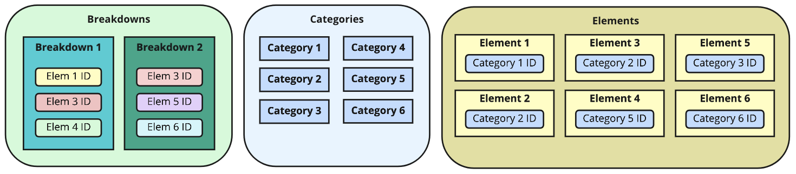
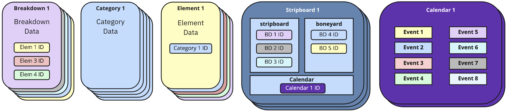
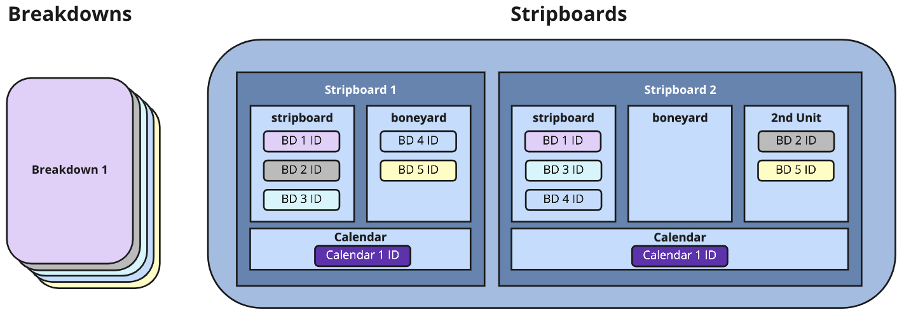

# **Universal Schedule Standard Documentation**

The central purpose of this standard is to allow for the storage and transport of schedules and script breakdown information between individuals and platforms. In order to do this, it is first necessary to understand the types of data we'll be dealing with and how those different types relate to each other.

Also, it is important to differentiate this format from a backup of any particular software system. This standard does not attempt to back up user settings, preferences, state or any other data outside of the schedule and breakdown. Nor does this standard attempt to backup the contents of the script, except for the data that is directly used in a breakdown.

Before beginning to read the details of the standard you may find it helpful to review the [small sample file](../samples/small_sample_schedule.uss) in the [/samples](../samples/) folder. It will help familiarize you with the structure of the data object.

## Table of Contents
- [Data Overview](#data-overview)
- [Structure and Format](#structure-and-format)
    - [JSON Construction](#json-construction)
    - [ID Values](#id-values)
    - [Strings](#strings)
    - [Numbers](#numbers)
    - [Date Format](#date-format)
    - [Include All Keys](#include-all-keys)
    - [Maintaining Data Types](#maintaining-data-types)
    - [File Extension](#file-extension)
- [Header Information](#header-information)
- [Breakdowns](#breakdowns)
    - [Breakdown Objects](#breakdown-objects)
    - [Category Objects](#category-objects)
    - [Element Objects](#element-objects)
- [Schedules](#schedules)
    - [Stripboard Objects](#stripboard-objects)
        - [Board Objects](#board-objects)
    - [Calendar Objects](#calendar-objects)
    - [Event Objects](#event-objects)
        - [Type](#type)
        - [Name](#name)
- [Extending the Standard](#extending-the-standard)

# Data Overview

The Universal Schedule Standard can store breakdown or breakdown+schedule data. Breakdown data is required and optionally you can also add schedule data to that breakdown information.

### Breakdowns

When breaking down the content in a script, the information from each scene will be entered into a breakdown sheet. That information will include a description of the scene and all of the elements needed when shooting that scene. Those elements include the cast members, props, wardrobe, special equipment, etc. So that the crew departments can keep track of the elements, the elements are grouped into categories.

Each breakdown is represented by a [breakdown object](#breakdown-objects), categories by [category objects](#category-objects) and elements by [element objects](#element-objects). The arrays that contain those objects are all root keys in the parent [universalScheduleStandard object](#structure-and-format). These three arrays of objects are required in every valid USS file. They represent the breakdown of the script.



### Breakdowns + Schedules

With all of the breakdown information available in the file, you may optionally also include schedule data that represents the order in which you plan to shoot the breakdown material. To do this, you will need to add [stripboard objects](#stripboard-objects) and [calendar objects](#calendar-objects) to the root USS object. The USS object must also contain all of the breakdown, category and element data described above.

Individual schedule scenarios are represented by [stripboard objects](#stripboard-objects). Each stripboard object contains an array of child [board objects](#board-objects), which in turn contain ordered arrays of breakdown object IDs. There are traditionally no less than two board objects and they are commonly named 'stripboard' and 'boneyard'. Other boards can be added too for things like additional units. Cumulatively each stripboard's board objects contain references to all of the breakdown objects contained in the schedule. Multiple stripboards may exist in a schedule, representing different arrangements of the breakdowns and thus different scenarios for the shoot.

Stripboard objects also reference one of potentially many [calendar objects](#calendar-objects). This calendar contains all of the date information about a particular scenario. Each date related piece of information is held in an array of [event objects](#event-objects). Each event object represents one type of event on the show. It could be a holiday, a company travel day, a rehearsal day, etc. These events will be used to reflect company days off and notable events in the final schedule.



Now that we have an understanding of the general structure of the data, let's take a look at how to construct it.

# Structure and Format

The Universal Schedule Standard (USS) conforms to the [JSON](https://www.json.org/json-en.html) standard using [UTF-8](https://www.utf8.com/) and is essentially a structured JSON store of relational data.

The complete USS object is constructed as:

```
{
  "universalScheduleStandard": {
    "id": string | UUID value | required,
    "author": string | name of individual creator | can be null,
    "company": string | name of the company for which the schedule was created | can be null,
    "created": string | ISO Date of the creation date of the schedule | required,
    "episode": string | the series episode number | can be null,
    "episodeName": string | the title of the series episode | can be null,
    "description": string | description of the schedule | can be null,
    "name": string | name of the schedule | required,
    "project": string | name of the feature, short, spot or series | can be null,
    "schedColor": string | name of the schedule revision color | can be null,
    "schedDate": string | ISO Date of the revision date of the schedule | can be null,
    "scriptColor": string | name of the script revision color | can be null,
    "scriptDate": string | ISO Date of the revision date of the script | can be null,
    "season": string | the episodic series season number or identifier | can be null,
    "source": string | name of originating app or site | required,
    "ussVersion": string | USS version number | required,

    "breakdowns": array of breakdown objects | required,
    "categories": array of category objects | required,
    "elements": array of element objects | required,

    "stripboards": array of stripboard objects | required only for schedules,
    "calendars": array of calendar objects | required only for schedules
  }
}
```

Please see the [/samples](../samples) folder for examples.

## **JSON Construction**
For general notes on the JSON standard, please refer to the following online sources:

- [MDM Web Docs - JSON](https://developer.mozilla.org/en-US/docs/Web/JavaScript/Reference/Global_Objects/JSON)
- [MDM Web Docs - Working with JSON](https://developer.mozilla.org/en-US/docs/Learn/JavaScript/Objects/JSON)
- [W3 Schools - JSON](https://www.w3schools.com/js/js_json.asp)

## **ID Values**
Throughout the USS object, every object contains its own unique ID value. Unique values help in the identification of any data that may already exist in a system. For example, when importing a breakdown into a third party app, an importer can check to see if individual breakdowns or elements have been previously imported, thus potentially reducing the amount of duplicated data.

It is considered best practice to use a 12 byte [BSON ObjectID](https://docs.mongodb.com/manual/reference/method/ObjectId/) but any UUID will suffice. An example ID would look like "6246e86c606cfc0016ed0a91".

## **Strings**
All strings should be stored as plain text. Rich text is not supported in the standard. Note that some key/value pairs may seem like they would take a number instead of a string. Please store values only in their described format. Values like scene numbers or page numbers may initially seem like numbers until you consider that both commonly contain letters.

## **Numbers**
Numbers can be stored as integers or decimal values, as required. They should not be stored as strings.

## **Date Format**
Dates should all be [ISO Date Format](https://www.iso.org/iso-8601-date-and-time-format.html) and should follow the format "2022-06-24T08:00:00.000Z"

## **Include All Keys**
You should include all keys in all objects, even if that key has no value. Skipping keys could throw errors in third party parsers. If you are not using a particular key, its value should be set to *null*. If the value for an array is empty you may use empty brackets ([]).

## **Maintaining Data Types**
Please maintain the correct data type for each key. The use of incorrect data types (i.e., using a number where a string is expected) will throw an error during parsing.

## **File Extension**
When saving files please use the file extension '.uss', which is an acronym of Universal Schedule Standard. 

# Header Information

The header keys describe the overall USS object's contents. Please see the [/samples](../samples) folder for examples.

The primary header keys are `id`, `author`, `created`, `description`, `episode`, `episodeName`, `name`, `project`, `schedColor`, `schedDate`, `scriptColor`, `scriptDate`, `season`, `source`, and `ussVersion`. All keys are required but their value may be *null* if no information is available or if the key doesn't apply (i.e., feature films don't have `episode`, `episodeName` or `season` data).

Please note that the `ussVersion` refers to the USS version, not the version of the schedule. This is used to differentiate different versions of the USS standard as it evolves.

The remaining keys are `breakdowns`, `categories`, `elements`, `stripboards` and `calendars`. Their values are arrays that store their related objects, described below.

# Breakdowns

All valid USS objects must contain arrays of [breakdown objects](#breakdown-objects), [category objects](#category-objects) and [element objects](#element-objects). These three types of object arrays will make up the breakdown information.

## **Breakdown Objects**

The breakdown objects contain information about a scene (or scenes) in a script. 

```
{
  "id": string | UUID value | required,
  "bannerText": string | text value for banners | can be null,
  "comments": string | can be null,
  "created": string | ISO Date | required,
  "description": string | description of scene | can be null,
  "elements": array of element object ID string values | required,
  "pages": number | decimal value of page eighths | can be null,
  "scene": string | scene number | can be null,
  "scriptPage": string | page number scene starts on | can be null,
  "duration": number | millisecond duration to shoot scene | can be null,
  "type": string | one of 'scene|banner' | required
}
```

The `elements` array contains element ID strings that represent all of the elements in that breakdown.

The `pages` number is a decimal representation of the physical length of a breakdown (i.e., script scene) in eighths of pages. For example, if a breakdown represents 1/8 of of a script page, its `pages` value would be .125. A 5/8 page scene would be .625, and so on. Do not attempt to directly store fractions (i.e. 7/8) in this value as it will throw an error.

The INT/EXT, Day/Night and Set properties of the breakdown are merely added as elements to that breakdown. For the slugline "EXT. BEDFORD FALLS BRIDGE - NIGHT" you would add three id's to the `elements` array of that breakdown object, such as:

```
{..., elements: ["5d9fc8cfc0efae0017a32e31", "5d9fc8cfc0efae0017a32de8", "5d9fc8d0c0efae0017a32e39"], ...}
```

...that correspond to these [element objects](#element-objects):

```
{ "id": "5d9fc8cfc0efae0017a32e31", ..., "name": "EXT" },
{ "id": "5d9fc8cfc0efae0017a32de8", ..., "name": "BEDFORD FALLS BRIDGE" },
{ "id": "5d9fc8d0c0efae0017a32e39", ..., "name": "NIGHT" },
```

You can look at the sample files for examples of how to structure this. It is best practice to only have one element for each of these breakdown properties present in the `elements` array. For instance, it would confuse parsers to have both "INT" and "EXT" elements in the same breakdown.

Some scheduling software includes categories as part of the breakdown itself. Examples of these keys are Unit, Location and Script Day. These are not included as keys in the breakdown object directly, but can be referenced by the inclusion of elements that are in those categories, as in the above slugline example.

The `duration` key refers to the estimated duration it will take to shoot the scene. This is measured in milliseconds in order to easily conform to common coding practices. An example value would be 5700000 if the scene were estimated to take 1h 35m to shoot. (95m * 60s * 1000)

The `type` key has only one of two values: 'scene', 'banner'. 'Scene' types are the standard type and represent all of the breakdown information for a one or more scenes. 'Banner' types are used for inline notes and headers in a stripboard and should store their text in the `bannerText` value.

Note that all three types can store values if needed. If you'd like to have 'banner' types store `elements`, feel free. Any breakdown object can store the full amount of information, regardless of its `type`.

## **Category Objects**

A category represents a group of similar elements. 'Cast Members', 'Props' and 'Wardrobe' are all examples of categories. All elements must be listed in exactly one category. Elements that are not referred to in a category will be ignored. Elements that exist in more than one category will only have the first instance recognized.

Category objects are constructed like this:

```
{
  "id": string | UUID value | required,
  "created": string | ISO Date of the creation date of this category | required,
  "name": string | name of this category | required,
  "ucid": number | corresponding universal category ID number | required
}
```

Category `name` may be any string value, but should follow the original intent of the category, as described in the [Category Identification Standard](https://github.com/thinkcrew/UniversalCategoryIdentification).

The `ucid` refers to the corresponding category ID number in the [Category Identification Standard](https://github.com/thinkcrew/UniversalCategoryIdentification). All categories must conform to this standard by either using one of the existing category ID numbers or by using a custom number that is outside of the protected ranges, as described in that standard.

## **Element Objects**

An element represents a particular person or thing that will be needed to film a particular scene. While 'Cast Members', 'Props' and 'Wardrobe' are all different categories, 'George', 'Umbrella', 'Tuxedo' are all examples of elements in those respective categories.

Element objects are constructed like this:

```
{
  "id": string | UUID value | required,
  "category": string | ID value of related category | required,
  "created": string | ISO Date of the creation date of this element | required,
  "daysOff" : array of integers representing days of week | required,
  "dropDayCount": number | integer of days between drop & pickup | required,
  "elementId": string | board identifier of element | can be null,
  "events": array of event objects | can be null,
  "isDood": boolean | include this element on day out of days? | required,
  "isDrop": boolean | allow drop days on day out of days? | required,
  "isHold": boolean | allow hold days on day out of days? | required,
  "isIdLock": boolean | lock elementID value? | required,
  "linkedElements": array of element object ID string values | can be null, 
  "name": string | name of element | required | required,
}
```

The `category` key is required and is an ID value to this particular element's category. Each element must belong to one category, although categories may exist that have no elements assigned to them.

The `daysOff` array contains integers representing the days of the week in which this element cannot play. See the [calendar objects](#calendar-objects) section for a description of how this key works in that object, as the expected values and behavior is the same.

The `dropDayCount`, `isDood`, `isDrop`, `isHold` keys all refer to properties related to how and whether the element will appear in the [day out of days](https://en.wikipedia.org/wiki/Day_out_of_days_(filmmaking)). When creating values for these keys, default to *true* if the data you're importing from doesn't contain these features.

The `elementId` stores an additional identifier for an element, traditionally referred to as a 'board ID'. This is primarily used for cast members, who are commonly referred to by a number. It is a string instead of a number to allow for the use of letters.

The `linkedElements` array is made up of element IDs and represent all of the elements that are linked to the element. Linking elements is used in some software to ensure that when a particular element is added to a breakdown, a number of other elements are automatically added as well. Examples commonly include actors and props they are always seen with. A doctor and their stethoscope, for example.

Events refers to specific calendar events for this element. If an individual actor has a fitting or cannot work on a particular day, events will be created for them to reflect this. The `events` array is made up of [event objects](#event-objects).

# Schedules

If representing a schedule, the USS object must also contain arrays of [stripboard objects](#stripboard-objects) and [calendar objects](#calendar-objects). If both the `stripboards` and `calendars` keys are not present, their arrays have no length, or are *null* then the USS object is considered to be just a breakdown.

Each parent stripboard contains a number of child board objects, which each contain lists of breakdown IDs. The order of those breakdown ID numbers and their assignment to a particular board represents different scenarios for the shoot.



## **Stripboard Objects**

A stripboard, sometimes referred to as a [production board](https://en.wikipedia.org/wiki/Production_board), represents a particular scenario for the show - the order in which the breakdown information will be shot. There can be many stripboards in a schedule.

The stripboard objects are constructed like this:

```
{
  "id" : string | UUID value | required,
  "boards" : array of board objects | required,
  "calendar" : string | calendar object ID string value | can be null,
  "name" : string | name of stripboard | required
}
```

The `name` is the name of this stripboard. For example, it could be "First Draft" or "Revised Blue 6/24/22".

Each stripboard object can contain multiple distinct `boards` inside of them. The most common examples of this are a stripboard and a boneyard. Both are unique boards and should contain unique values. Some scheduling software may also allow for additional boards representing additional units, etc. Each of these boards are represented by [board objects](#board-objects).

### **Board Objects**

The [stripboard object's](#stripboard-objects) `boards` array is made up of board objects, which are constructed like this:

```
{
  "id": string | UUID value | required,
  "name": string | name value of board | required,
  "breakdownIds": ordered array breakdown object ID values, or an array of arrays of those values | required
}
```

The board object `name` is not the same as the `name` key in the [stripboard objects](#stripboard-objects). The board objects `name` should merely describe the individual board's intended purpose. If you're just including a stripboard and a boneyard, it is best practice to name your boards 'stripboard' and 'boneyard'. Additional boards could be called 'second unit', etc., at your discretion.

Important: the order of the `breakdownIds` is the order of the breakdowns in this stripboard, so ensure that you are storing the IDs in the intended order.

In any stripboard breakdowns can be grouped into shooting days. To represent shooting days, group the breakdown ids into sub-arrays inside `breakdownIds` array. The number of the shoot day and its date are inferred by its order in array and the start date in the calendar. If the stripboard does not have any day breaks, then the `breakdownIds` value would simply be a an array of breakdown ids without grouping them into sub-arrays. Note that this means that the items in the `breakdownIds` array can have a type of either `string` or `array`.

```
stripboards: {
  ...
  "boards" : [
      { 
        ...
        "name": "Stripboard"
        "breakdownIds" : [
            [                              
              "5d9fc8cfc0efae0017a32e31", ⎤
              "5d9fc8cfc0efae0017a32de8", ⎥ This is Day 1
              "5d9fc8d0c0efae0017a32e39"  ⎦
            ],
            [                              
              "603c49bb9d67b45889ade2a7", ⎤ This is Day 2
              "623c9a26aad4d876cc370bf0"  ⎦
            ]
        ]
      }
  ],
}
```

The length of the combined arrays of the `breakdownIds` across all boards and sub-arrays within a stripboard object must be equal to the total number of breakdown objects in `breakdowns`. For example, say you have two boards -- 'stripboard' which cumulatively has 75 IDs and 'boneyard' which has 25 IDs -- you must have a total of 100 breakdown objects in your `breakdowns` array. [Breakdown objects](#breakdown-objects) that are not referenced in a `boards.breakdownIds` array will be ignored.

## **Calendar Objects**

Calendar objects represent an overall calendar for the show and would traditionally include a start date, days of the week when there's no filming (weekends), and any unique events such as holidays, company travel, rehearsal days, etc.

Multiple calendars may be included in the `calendars` array, representing different scenarios for the show. Calendar objects are constructed as follows:

```
{
  "id" : string | UUID value | required,
  "daysOff" : array of integers representing days of week | required,
  "events" : array of events objects | required,
  "name" : string | name of calendar | required,
}
```

The `daysOff` array contains integers representing the days of the week when no filming will occur. The days of the week are represented by the following values:

| Day       | Value |
| :---      | :---: |
| Sunday    |   0   |
| Monday    |   1   |
| Tuesday   |   2   |
| Wednesday |   3   |
| Thursday  |   4   |
| Friday    |   5   |
| Saturday  |   6   |

To represent not filming on Sunday and Saturday, the `daysOff` array would be [ 0, 6 ]. No values over 6 should be used, nor should negative numbers. Duplicates should be avoided. The order of the array is not important.

The `name` is simply the name the user gave to this calendar. It could be "Start in January", or "Push Two Weeks".

Each calendar object may contain a number of events. The `events` array is made up of [event objects](#event-objects).

## **Event Objects**

Event objects are used in both [calendar objects](#calendar-objects) and [element objects](#element-objects). They are constructed as follows:

```
{
  "id" : string | UUID value | required,
  "date" : string | ISO Date for this event | required,
  "type" : string | one of 'start|dayOff|event' | required,
  "name" : string | name of the event, see name section below | can be null
}
```

The `date` key is a standard ISO Date and represents the date of this particular event.

### Type

The `type` key sets the general type of the event and is limited to the below values:

| Value          | Description                                                                 |
| :---           | :---                                                                        |
| 'start'        | this event object will represent the date of the first day array in a board |
| 'dayOff'       | this event object will represent an individual date to skip on a board      |
| 'event'        | denotes a variable type of event, such as rehearsals, travel, etc           |

It's important to draw a distinction between the `daysOff` array in the [calendar object](#calendar-objects) and the potential value of 'dayOff' in the `type` key of the event object. The `daysOff` array is denoting the days of the week that the production will not be filming (every Sat & Sun, for example). The 'dayOff' value is noting that an individual date will be a day off for the show (June 3, 2022, for example). The 'dayOff' value could be used for things like turnaround days.

### Name

The `name` represents the individual name of the `type` value. Note that when the `type` is 'start', `name` can be set to *null*. Here is a list of potential values, based on the preceding value of the `type` key.

| Type Value     | Name Value                                                                                         |
| :---           | :---                                                                                               |
| 'start'        | *null*                                                                                             |
| 'dayOff'       | best practice is one of 'holiday\|dayOff', can use custom values here, as needed                   |
| 'event'        | best practice is one of 'fitting\|rehearsal\|travel\|photo', can use custom values here, as needed |

Adherence to the best practice values above is technically optional, but strong consideration should be given to working within these naming conventions where possible. This will increase the chances that third party parsers will be able to correctly identify your events.

___

# Extending the Standard

Removing, renaming or altering the structure of the existing key/value pairs in the USS object is not allowed. However, you may add your own custom keys to the object. If you need to add keys, please adhere to the following rules.

All custom keys must:

- Adhere to the JSON standard
- Begin with an underscore (ie `_keyName`)
- Not interfere with or alter the existing structure of the USS object
- Add values to the object that aren't already included in this standard (ie don't just add values to the object under your own custom name when a key already exists for that purpose)

If you feel that your custom key is useful to the overall standard, you may submit a [pull request](https://github.com/thinkcrew/UniversalScheduleStandard/pulls) and your ideas will be considered for inclusion in the official standard.
